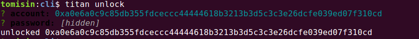
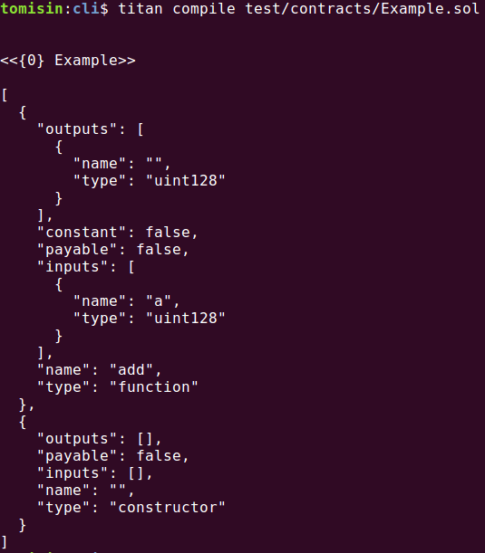
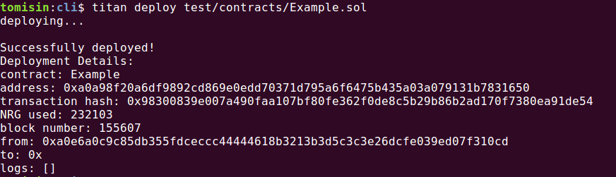
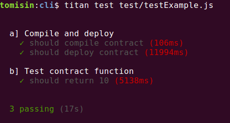
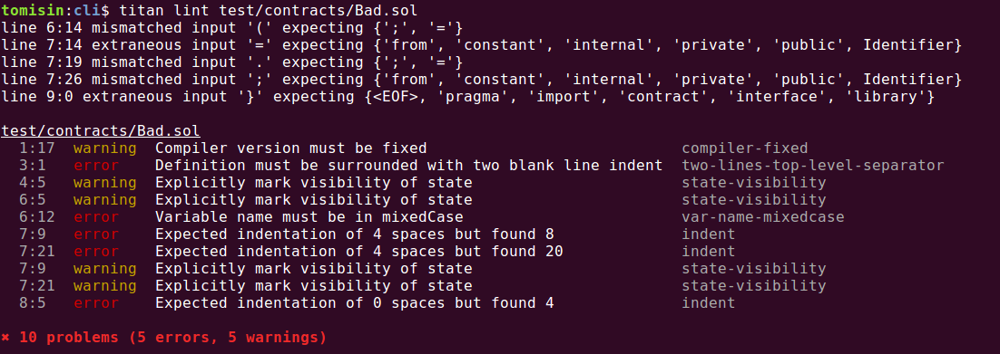
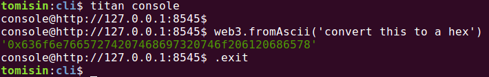

# Titan-CLI

Command Line Interface for interacting on AION 

---

## Setup

- `npm i -g @titan-suite/cli` or `yarn add global @titan-suite/cli`
- In your project root, create a `titanrc.js` file and specify the following:
    - `host`: the URL of your `aion-web3` provider
    - `port`: the port exposing an `aion-web3` instance, usually *8545*
    - `mainAccount`: the default address to call functions with
    - `mainAccountPass`: the password of this account
```javascript
   module.exports = {
       "host": "http://127.0.0.1",
       "port": 8545,
       "defaultAccount": "",
       "password": ""
   }
```
---

## Examples


### Unlock an account:

- `titan unlock`
- You will be prompted to enter an AION address and password



### Compile a contract:

- `titan compile <path/to/contracts/Example.sol>`
- Compile specific contract 
    - `titan compile <path/to/contracts/Example.sol> -n <contract_name>`
- Output more details about the contract
    - `titan compile <path/to/contracts/Example.sol> -d`



### Deploy a contract:

- `titan deploy <path/to/contracts/Example.sol>`
- Deploy a specific contract within the contract file:
    - `titan deploy -n Test <path/to/contracts/Example.sol>`
- Pass parameters:
    - `titan deploy -p 5 <path/to/contracts/Example.sol>`
- The details of the deployed contract will be stored as `./build/bots/<contractName>.json`



### Run a unit test file

- `titan test <path/to/contracts/testExample.js>`



### Generate a simple dApp 

- `titan init`

### Use a prebuilt dApp

- `titan unpack`
    - Select which pack you want from the options
- `titan unpack <pack_name>`

### Lint a smart contract

- `titan lint <path/to/contracts/Bad.sol>`



### Launch an `aion-web3`-ready console on your AION node

- `titan console`



---

## Instructions

- `titan --help`
